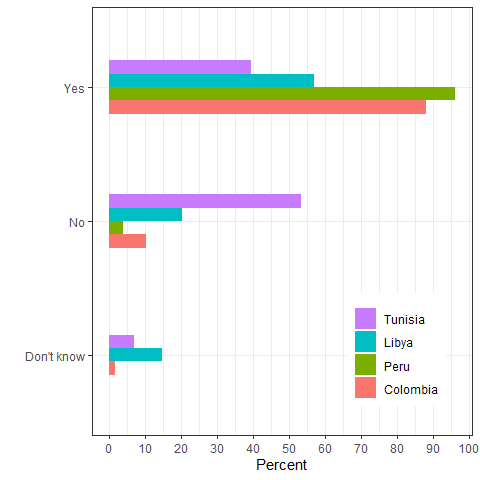
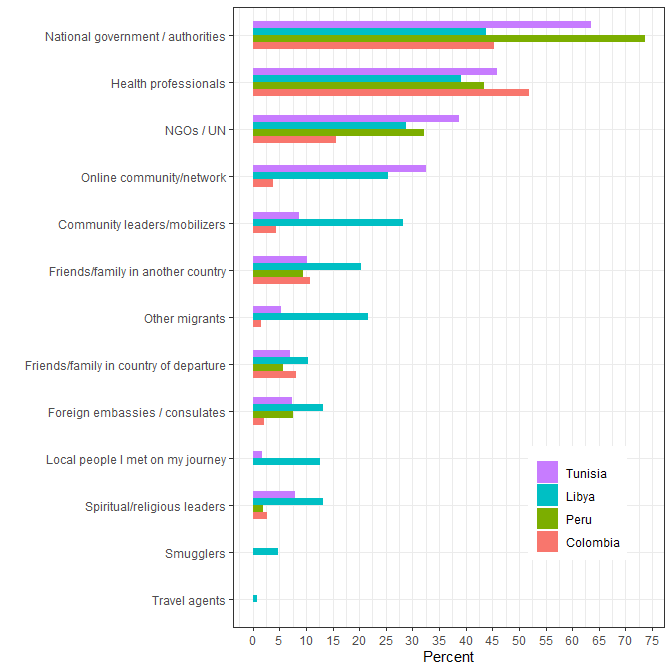
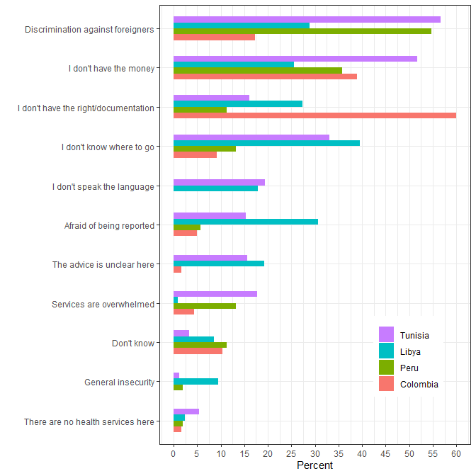
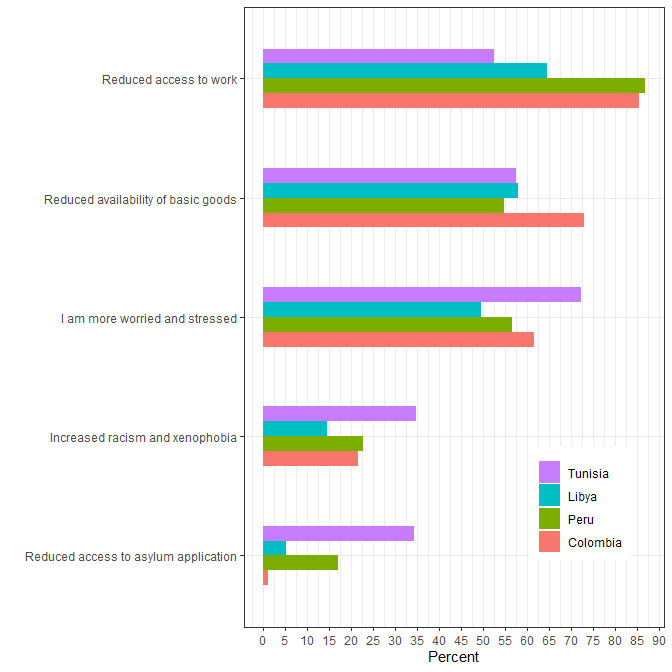
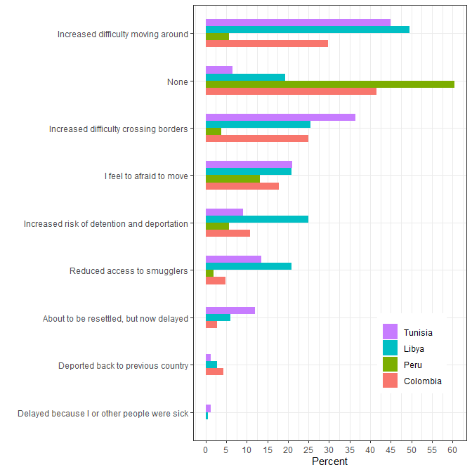

Impact of COVID-19 on refugees and migrants
================
Mixed Migration Centre, Geneva, 1st Update of 27 April 2020

 

**This is the first update on the situation for refugees and migrants on
mixed migration routes around the world in light of the COVID-19
pandemic. Using data collected by MMC, the objective of the global
updates is to provide regular up-to-date findings on COVID-19 awareness,
knowledge and risk perception, access to information, access to
healthcare, assistance needs and the impact on refugees’ and migrants’
lives and migration journeys . This series provides an aggregated
overview; more detailed, thematic and response-oriented COVID-19
snapshots are also developed in each of the MMC regional offices and
available
[here](http://www.mixedmigration.org/resource-type/covid-19/).**

## Key Messages

• Interviewed refugees and migrants in Colombia, Peru, Libya and Tunisia
show very high levels of awareness and knowledge (e.g. on symptoms,
vulnerable groups and prevention) on COVID-19; hardly anyone has been
tested

• The national government is most often seen as a trustworthy source of
information on COVID-19, but it is not always the most used. In Libya,
for example, other migrants are the main source of information

• Across the 4 countries, only 37% of interviewed refugees and migrants
said they could access healthcare if they had coronavirus symptoms,
although in Colombia more than half said they could

• The main barriers to healthcare for the refugees and migrants are
discrimination against foreigners, lack of money and lack of legal
documents, while in Libya fear of being reported and general insecurity
play a slightly larger role

• Over 85% of respondents said they need additional assistance since the
crisis began, but less than one-third on average had received additional
assistance. Respondents primarily cite basic needs: food, water and
shelter, but also cash and sanitary items

• More than two-thirds of respondents said they had lost income due to
COVID-19 restrictions, with highest percentages in Colombia and Peru.
Respondents cite reduced access to work as the main impact of the crisis

• Most respondents had not yet changed their migration plans due to the
crisis, although respondents in North Africa report a greater impact of
the COVID-19 crisis on their migration journeys than those in Colombia
and Peru

## Respondents

692 respondents were interviewed between 7 and 20 April 2020, with 185
of them in Colombia (mean age: 34; 75% women), 212 in Libya (mean age:
31; 28% women,), 53 in Peru (mean age: 33; 49% women,), and 242 in
Tunisia (mean age: 29; 33% women). In Colombia and Peru, all respondents
were Venezuelan nationals. In Libya and Tunisia, more than 30
nationalities were represented, with more respondents from Sudan (15%),
Nigeria (13%), and Côte d’Ivoire (11%). Out of all respondents,
approximately 10% reported living in camps or informal settlements in
the past six months (Colombia: 11%, Peru: 6%, Libya: 1%, Tunisia: 16%).

A summary of the methodology utilized for this study can be
[here](http://www.mixedmigration.org/4mi/4mi_faq/). Figures for Peru
should be interpreted with caution, since the number of interviews in
this country is low. All figures are rounded to the nearest whole
number. This first global update only reports on Colombia, Peru, Libya
and Tunisia, which is where MMC first rolled out the adapted 4Mi
COVID-19 survey. Data collection has also started in West Africa, East
Africa and Asia and future updates will include the data from these
regions.

## Awareness, knowledge and risk perception

Knowledge and risk perception seem high amongst respondents. All 692
respondents reported they had heard of COVID-19, and across all
countries more than 90% reported they have seen people acting more
cautiously since the beginning of the crisis. Likewise, approximately
90% of them agreed or strongly agreed that they are worried about
catching coronavirus (Colombia: 91%, Libya: 84%, Peru: 98%, Tunisia:
93%). Somewhat lower percentages also agreed or strongly agreed they are
worried about transmitting coronavirus (Colombia: 79%, Peru: 81%, Libya:
59%, Tunisia: 79%).

Respondents also know coronavirus symptoms, with dry cough (80% to 92%
of respondents across countries), fever (70% to 92%) and difficulties
breathing (74% to 81%) being cited the most frequently. Respondents less
frequently indicated that the virus can be asymptomatic (7% to 25%).
Furthermore, they know which groups are more at risk, with older people
cited more frequently (Colombia: 95%, Peru: 89%, Libya: 81%, Tunisia:
84%), followed by people who are already ill with another condition, and
health workers.

A vast majority of respondents take measures to protect themselves, with
washing hands more regularly (Colombia: 80%, Peru: 68%, Libya: 86%,
Tunisia: 82%) and staying at home or isolating from others (Colombia:
93%, Peru: 83%, Tunisia: 74%) being the most commonly cited. In Libya,
however, far fewer respondents reported staying at home (37%). Also in
Libya, 5% reported not taking any measures, while the proportion is
close to 0 in the other countries. Overall, and except in Tunisia,
respondents report they are able to keep the recommended 1.5 metre
distance, see Figure 1. Almost no respondents were tested for
coronavirus (Colombia: none, Peru: 1, Libya: 3 with 26 refused answers,
Tunisia: 3).  
 

***Figure 1: Do you think you are able to practice 1.5 metre
distancing?***

## Access to information

The national government and authorities were the most frequently cited
sources of information on COVID-19 (Colombia: 65%, Peru: 83%, Tunisia:
63%), except in Libya, where ‘other migrants’ were cited as the main
source of information (40% of respondents), followed by the government,
at 34%.

Most participants received information on the virus via the media
(Colombia: 86%, Peru: 91%, Libya: 64%, Tunisia: 65%), and social media
(Colombia: 61%, Peru: 72%, Libya: 53% , Tunisia: 79%), with Facebook
(56% overall), WhatsApp (51%), and YouTube (21%) being the most
frequently cited social media across countries.

The government is seen as the most trustworthy source of information
(Peru: 74%, Libya: 44%, Tunisia: 73%), except in Colombia, where health
officials (52%) are perceived as slightly more trustworthy than the
government (45%), see Figure 2. Interestingly, there are some
differences between the sources of information that are more frequently
used and those that are considered more trustworthy. For example,
although the online community is used more (Colombia: 35%, Peru: 15%,
Libya: 33%, Tunisia: 72%) than NGOs, NGOs and the UN are, overall,
considered more trustworthy than the online community. Perhaps this is
because the sources of information that respondents consider more
trustworthy are simply not always available and that they have no choice
but to rely on less trustworthy sources.  
 

***Figure 2: Who do you think is a trustworthy source of information on
coronavirus?***

## Access to healthcare

Overall, only 37% of participants believe they would be able to access
healthcare if they had coronavirus symptoms, but there are important
differences between countries. In Colombia, more than half thought they
could access services, but in other countries the figure was lower
(Peru: 17%, Libya: 38%, Tunisia: 29%). In addition, another third of
respondents across regions - with the exception of Colombia (11%) –
reported that they simply do not know whether they would be able to
access health services (Peru: 32%, Libya: 34%, Tunisia: 34%).

The respondents reported that the main barriers to accessing healthcare
are a lack of money (Colombia: 39%, Peru: 36%, Libya: 26%, Tunisia: 52%)
and discrimination against foreigners (Colombia: 17%, Libya: 29%), this
reason seeming particularly important in Tunisia (57%) and Peru (55%),
see Figure 3. Not having documentation also seems to be an important
barrier, particularly in Colombia (60%). Finally, fear and insecurity
seem more important in Libya (9%) than in the other countries.  
 

***Figure 3: What are the barriers to accessing healthcare?***

## Assistance needs

More than 85% of all respondents stated that they are in need of extra
help since the COVID-19 crisis began (Colombia: 92%, Peru: 74%, Libya:
77%, Tunisia: 93%). These respondents (n=598) mentioned that what they
needed most was food, water, and shelter (76%), cash (71%), sanitary
items (43%), access to work and livelihoods (28%), and access to health
services (23%).

In Colombia and Peru, 35% and 32% of respondents, respectively, stated
that they had received additional assistance since the coronavirus
crisis began. In Libya and Tunisia, they were 7% and 22%, respectively.

Out of the total number of 149 respondents who received additional
assistance, 79% received food, water and shelter; 29% received cash; and
20% received sanitary items such as sanitizer, mask, or gloves. The main
providers of additional assistance were NGOs (35%), the local population
(34%), and the government (29%).

## Impact on refugees’ and migrants’ lives

Overall, more than two-thirds of respondents reported that they lost
income due to coronavirus restrictions, and this is higher among those
in Latin America than North Africa (Colombia: 89%, Peru: 87%, Libya:
61%, Tunisia: 59%). Respondents also reported that reduced access to
work was the main impact on their day-to-day life (Colombia: 85%, Peru:
87%, Libya: 65%, Tunisia: 53%), followed by reduced availability of
basic goods (62% overall), and stress (61% overall), see Figure 4.

 

***Figure 4: What impact has the crisis had on your day-to-day life?***

## Impact on migration journeys

The impact of the crisis on refugees’ and migrants’ journeys differs
between Colombia/Peru and Libya/Tunisia (see Figure 4). Although on
average a majority of respondents stated that they had not changed their
plans as a result of the coronavirus outbreak, these percentages are
higher in Latin America than in North Africa (Colombia: 77%, Peru: 62%,
Tunisia: 51%, Libya: 35%). Moreover, in Colombia and Peru, 42% and 60%
of respondents stated that the coronavirus crisis had no impact on their
migration journey, while these percentages are much lower in North
Africa.

In Libya and Tunisia, a much higher number of respondents report
increased difficulty to move around, increased difficulty to cross
borders, fear of moving and reduced access to smugglers. In Libya, in
particular, respondents also cited increased risk of detention and
deportation. One explanation for this difference between the two regions
could be that Venezuelan refugees and migrants, as a community, in
Colombia and Peru are more settled and more likely to consider these
countries as (temporary) destinations. In Latin America, 87% of
respondents said they had reached their destination, whereas in North
Africa they were only 14%. Those who are more settled are therefore also
more likely to report reduced access to work, as shown in the previous
graph, while (primarily) sub-Saharan refugees and migrants in North
Africa are more likely to be in transit, and thus report experiencing
more of an impact of the crisis on their migration journeys.

 

***Figure 5: What impact has the coronavirus crisis had on your
migration journey?***

 

### Acknowledgement

The owner and source of the data used for this study is the [Mixed
Migration Centre](http://www.mixedmigration.org/), and this study has
been published first
[here](http://www.mixedmigration.org/resource-type/covid-19/) on 27
April 2020. Data analyst: Jean-Luc Jucker, PhD
