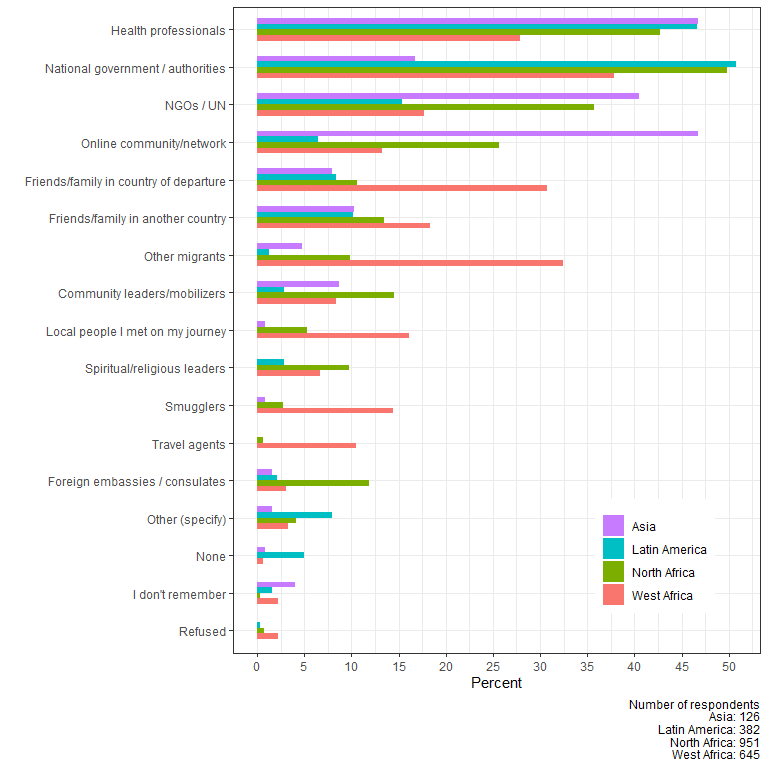

Impact of COVID-19 on refugees and migrants, Update 3
================
Mixed Migration Centre, 27 May 2020

 

**This is the third update on the situation for refugees and migrants on
mixed migration routes around the world in light of the COVID-19
pandemic based on data collected by the [Mixed Migration
Centre](http://www.mixedmigration.org/) in Asia, Latin America, North
Africa and West Africa. The objective of the global updates is to
provide regular up-to-date findings on COVID-19 awareness, knowledge and
risk perception, access to information, access to healthcare, assistance
needs and the impact on refugees’ and migrants’ lives and migration
journeys. Published once every two weeks, this series provides an
aggregated overview; more detailed, thematic and response-oriented
COVID-19 snapshots are also developed in each of the MMC regional
offices and available
[here](http://www.mixedmigration.org/resource-type/covid-19/).**

## Key Messages

• Awareness, knowledge and risk perception: only 3 of 2,110 respondents
had not heard of coronavirus. Respondents in Asia report higher
awareness and taking more measures to protect themselves than in other
regions. In West Africa, 20% of respondents are not taking measures to
protect themselves, an increase on the previous update

• Assistance needs: at 87% overall, the percentage of respondents who
state that they are in need of extra help has remained remarkably stable
since data collection began in April, with marginal differences between
regions (range: 85% to 89%)

• Access to information: while overall, governments remain the most
trusted information source on COVID-19, there are wide disparities
across regions: respondents in Asia more often trust (47%) and use (67%)
online communities, and far less frequently cite government as an
information source (17% trust and 11% use); whereas in West Africa there
is greater use of other migrants and trust in friends and family

• Access to healthcare and prevention: the same barriers to healthcare
persist, with 39% citing the cost of care, 26% that they don’t know
where to go. Language is seldom reported as a barrier, except in India,
where 33% consider it a barrier

• Impact on refugees’ and migrants’ lives: loss of access to work (66%)
and loss of income (60%) remain major impacts of the crisis on refugees
and migrants. Only in Indonesia is the figure much lower, and this is
because few were earning an income beforehand. The proportion continuing
to work is highest in West Africa, at 20%.

• Remittances: The impact on sending remittances home varies widely
between regions. In Latin America more than half (51%) report they are
no longer able to send remittances due to loss of income, while in Asia
4% report this impact

• Impact on migration journeys: the impact of COVID-19 on migration
journeys differed between regions and countries, with generally the
lowest impact among Venezuelans in Latin America and among Afghans in
India and Indonesia, and the highest impact in West Africa and, to a
slightly lesser extent, North Africa

## Respondents

2,110 respondents were interviewed between 6 April and 10 May 2020: 126
in Asia, 382 in Latin America, 957 in North Africa, and 645 in West
Africa. In West Africa and North Africa respondents come from a variety
of origin countries, while only Venezuelans are interviewed in Latin
America, and only Afghans in Asia. Interviews took place in the
following 9 countries:

|    Region     |   Country    | Number of respondents | Percent women | Mean age |
| :-----------: | :----------: | :-------------------: | :-----------: | :------: |
|     Asia      |    India     |          58           |      43       |    34    |
|               |  Indonesia   |          68           |      40       |    28    |
| Latin America |   Colombia   |          292          |      72       |    34    |
|               |     Peru     |          90           |      54       |    33    |
| North Africa  |    Libya     |          442          |      29       |    30    |
|               |   Tunisia    |          515          |      35       |    28    |
|  West Africa  | Burkina Faso |          204          |      41       |    28    |
|               |     Mali     |          234          |      18       |    27    |
|               |    Niger     |          207          |      28       |    31    |
|    Overall    |              |         2110          |      38       |    30    |

## Methodology

A summary of the methodology can be found
[here](http://www.mixedmigration.org/4mi/4mi_faq/). The data presented
is cumulative, and includes data from previous Global Updates. All
figures are rounded to the nearest whole number. Figures for countries
where the number of interviews is less than or around 100 should be
interpreted with caution. Unless specified, the number of observations
for all analyses and visualisations corresponds to those presented in
the above table. Note that for most items of the questionnaire,
respondents can select several answer options, and in some analyses it
was not possible to include ‘none’ answer options. 34 interviews were
discarded from analyses due to questionnaire incompleteness and data
quality.

## Awareness, knowledge and risk perception

Knowledge of the coronavirus is still high among respondents. Only 3
respondents, interviewed in Libya, reported that they had not heard of
COVID-19. Furthermore, 92% of all respondents stated that they had seen
people acting more cautiously, with a minimum of 91% in Burkina Faso,
and a maximum of 97% in Indonesia.

Similarly, across regions, 90% of respondents agreed or strongly agreed
that they are worried about catching coronavirus (range: from 88% in
West Africa to 95% in Asia). In contrast, 19% of all respondents are not
worried about transmitting coronavirus (disagreed or disagreed strongly
that they were worried), with the highest percentage in West Africa (25%
in the region, with a maximum of 28% in Burkina Faso) and the lowest
percentage in Asia (5%).

84% of all respondents stated that they know how to protect themselves
and others, but again with differences between regions, with higher
proportion of respondents confident about this in Asia (91%) and Latin
America (98%) than in North Africa (84%) and West Africa (75%).

Respondents know coronavirus symptoms, with dry cough (83% of all
respondents), fever (81%) and difficulties breathing (80%) being cited
the most frequently. Only 15% of respondents indicated that the virus
can be asymptomatic, though this percentage is higher in Asia (27% in
the region, and up to 40% in India). Likewise, respondents know which
groups are more at risk, with older people cited more frequently (83%
overall), followed by people who are already ill with another condition
(58%), and health workers (34%)1. However, 22% cite babies and children
under five, which are not a high-risk category (46% in Latin America,
and up to 55% in Colombia).

More than 90% of all respondents take measures to protect themselves
from catching COVID-19, with washing hands more regularly (76% overall)
and wearing a mask (59%) being the most commonly cited. In Asia and
Latin America, staying at home (88% in both regions) is much more
frequent than in North Africa (55%) and especially West Africa (8%). The
high percentage observed in Latin America (88%) is consistent with the
fact that 86% of respondents in Latin America also stated that they had
reached their final destination (13% of respondents in North Africa had
reached their destination and 9% of respondents in West Africa).
However, in Asia, none had reached their destination. It is likely that
the severity of lockdown measures and their enforcement is influencing
the degree to which respondents report staying at home, but it is
interesting to explore further how many refugees and migrants have a
home to stay in. Those who havereached their destination (e.g. in Latin
America), or who had been immobile for some time before the pandemic
hit, may be more able to stay at home (see also below, impact on
migration journeys).

Respondents in Asia cited avoiding crowded spaces (65%) and keeping
physical distance (60%) more frequently than respondents in any other
region (range: 21% to 51% and 18% to 40%, respectively), although
respondents in Latin America more frequently cited using masks (77%) and
gloves (56%) than in the other regions.

Overall, a majority of respondents (53%) reported that they are able to
keep the 1.5 metre distance, but again with higher percentages in Asia
(87%) and Latin America (91%) than in North Africa (48%) and West Africa
(31%), see Figure 1.

***Figure 1: Do you think you are able to practice 1.5 metre
distancing?***

   

Overall, few respondents (8%) reported not doing anything to protect
themselves against coronavirus. That said, when data are disaggregated
by region and country, notable differences emerge. In Asia and Latin
America, less than 1% of respondents reported not doing anything to
protect themselves, whereas in West Africa, this figure was 20%, and up
to 31% in Burkina Faso (this is an increase of almost 10% in this
country since the previous update).

Out of these 166 participants (129 of them in West Africa) who aren’t
taking any measures, 39% stated that this is due to a lack of protective
gear (masks, gloves, sanitizer), and 38% because they do not feel it is
necessary; 25% said that they simply cannot practice physical distancing
due to their living situation. 15% (25 people) said they did not know
what precautions to take.

Finally, less than 2% (n=36) of all respondents had been tested for
coronavirus: 5 in Latin America, 8 in North Africa (with 42 refused
answers, however), and 23 in West Africa (2 refused answers); no
respondent was tested in Asia.

  

## Access to information

The government is overall the most-used source of information among
respondents (47% reported using it), but the figure is far higher in
Latin America (69%) than in Asia (only 11%), with North Africa (47%) and
West Africa (42%) closer to the overall percentage. In Asia, the
most-used source is the online community (67%), followed by NGOs and the
UN (44%), and the government comes eighth. This may be related to
language barriers: in Latin America, for example, refugees and migrants
speak the same language used by authorities and local media. This is not
the case in other regions, and can prove an obstacle to accessing
services. Likewise, in North Africa, the online community (53%) is cited
slightly more often than the government (47%) or NGOs/UN (36%). In West
Africa, other migrants (58%) are cited more often than the government,
especially in Niger (73%). As was previously found (see second global
update here), respondents in Mali (39%) and Niger (21%) are more likely
to use smugglers as a source of information than in any other region
(Asia and Latin America: none; North Africa: 6%).

In most regions, the most-used sources of information are also the more
trusted. For example, in Asia, the online community is cited as more
trustworthy (47%, tied with health professionals) than the government
(17%), see Figure 2. In North Africa, however, the government (50%) and
the UN/NGOs (36%) is seen as more trustworthy than the online community
(26%), although we have seen that the latter is used more in that
region. Overall, the second most trustworthy source of information after
the government are health professionals (40%), although these are used
less than the online community and other migrants.

***Figure 2: Who do you think is a trustworthy source of information on
coronavirus?***

   

Respondents in Asia, who are often registered with UN agencies, seem to
have more trust in NGOs and the UN (41%) compared to other regions
(range: 15% to 36%), and West Africa respondents have more trust in
friends and family (49%, counting together friends in country of
departure and destination) than in other regions (range: 18% to 24%).

Most participants received information on the virus via mainstream media
(69% overall), social media (62%), or in-person (47%)2, with differences
between regions reflecting, again, the most-used sources of information.
For example, in Asia, 86% of respondents reported receiving information
via social media (whereas social media are used by 47% to 70% of
respondents in all other regions). Likewise, in Latin America, 85%
reported using the traditional media, which arguably reflects their
higher degree of trust in the government. As previously found (see
second update), respondents in West Africa used more various media, such
as street advertising (37%), phone calls (49%), or simply in-person
communication (60%, and up to 76% in Burkina Faso).

Out of all participants who reported using social media (n=1,293), 86%
and 84% reported using Facebook and WhatsApp, respectively, which
confirmed results from previous updates.

  

## Access to healthcare and prevention

Overall, only 38% of participants believe they would be able to access
healthcare if they had COVID-19 symptoms, with a minimum of 31% in North
Africa, and a maximum of 47% in West Africa. However, the largest
differences are within regions (51% in Colombia, but 13% in Peru; 63% in
Niger, but 36% in Burkina Faso). Also note that 28% of all respondents
simply don’t know whether they would be able to access healthcare, with
the lowest regional percentage in Latin America (18%) and highest
regional percentage in North Africa (35%).

As in previous updates, the main barriers to accessing healthcare are a
lack of money (39% overall), followed by not knowing where to go (26%),
and discrimination against foreigners (25%). Discrimination against
foreigners remains the most frequently cited barrier in North Africa
(39%), Tunisia (49%), and Peru (50%), whereas it does not seem to be
important in Asia (4%) and West Africa (8%), see Figure 3. MMC partners
in Asia have observed that discrimination deters refugees’ and migrants’
use of public health services, and pushed them to use private services.

***Figure 3: What are the barriers to accessing healthcare?***

   

A lack of legal documentation is also an important barrier in Colombia
(59%, and note figure is only 10% in Peru), but less in North Africa
(16%) and West Africa (9%), as discussed in the previous update. As for
Asia, there are some important differences between countries, although
note that the number of interviews is low. In India, the lack of legal
documentation is cited by 10% of respondents, but it is not mentioned at
all in Indonesia. As mentioned above, the greater likelihood of
respondents in Asia being registered with a UN agency means they are
more likely to have documentation to access health services. 33% of
participants in India mentioned not speaking the language as a barrier,
whereas this figure was only 3% in Indonesia. Language is cited more
often as a barrier in North Africa (17%). General insecurity is reported
as a barrier to access by 9% of respondents in Libya, and barely at all
in other countries.  

## Assistance needs

Since the first update, the percentage of respondents who state that
they are in need of extra help has remained remarkably stable: 87%, with
marginal differences between regions (range: 85% to 89%). Overall, 11%
of respondents stated that they do not need extra help since the crisis
began, with higher percentages in Mali and Libya (17% each), and Peru
(19%).

For the 1,827 respondents who did report that they need extra help, the
most frequently items cited were, again, cash (77% overall), basic needs
such as food, water and shelter (60%, but note this is about 10% less
than in the previous update), and sanitary items such as sanitizer and
masks (44%). The pattern of needs between regions persists (cash is
cited more often in North Africa and West Africa, but basic goods are
cited more often in Latin America). In Asia, a need for access to health
services was cited considerably more frequently (51%, and 68% in India)
than in any other region (range: 13% to 22%). Likewise, psychological
assistance was mentioned much more often in Asia (28%, and up to 36% in
India) than in other regions (range: 3% to 15%).

Overall, and as in the previous update, 21% of all respondents (n=433)
stated that they had received additional assistance since the
coronavirus crisis began, with higher figures in Latin America (31%)
than in West Africa (19%) and North Africa (17%, with a minimum of 10%
in Libya, where access is particularly difficult). The regional
percentage in Asia was 25%, but the highest percentage recorded across
all countries was in India, with 43% of respondents reporting they
received extra help (the number of interviews is quite low). It must be
noted that in some countries, a proportion of respondents were referred
to 4Mi by NGOs providing assistance. For the 433 respondents who
received extra assistance, the most frequently cited items were food,
water and shelter (67%, slightly more than what is reportedly needed
overall), followed by sanitary items (29%, compared to 44% needed), cash
(22%, compared to 77% needed), and information about the virus (21%,
compared to 15% needed). Other gaps in assistance can be seen in Figure
4.

  
***Figure 4: Kind of assistance received (bars) vs. assistance needed
(lines)***

   

Overall, the main providers of additional assistance are still NGOs
(41%, and up to 50% in West Africa, with a maximum of 72% in Niger), the
local population (28%), and the government (20%), except in Libya, where
family and friends were more frequently cited (54%). Assistance from the
UN was far higher in Asia (69%) than in all other regions (range: 3% in
Latin America to 10% in North Africa and West Africa).

## Impact on refugees’ and migrants’ lives

As found previously, the main impact of COVID-19 on refugees’ and
migrants’ lives is reduced access to work (66%), followed by more stress
(60%), and reduced availability of basic goods (50%).1 The inclusion of
Asia data marginally increased the percentage reporting an impact on
access to asylum (15% overall, and 23% in Asia). Respondents in Asia
reported higher levels of worry and stress (79%) than in other regions
(range: 53% to 62%), see Figure 5.

  

***Figure 5: What impact has the crisis had on your day-to-day life?***

   

60% of all respondents cited a loss of income due to coronavirus
restrictions. The highest percentage was in Latin America (90%), and the
lowest percentage was in Asia (42%, with a minimum of 13% in Indonesia,
where it should be noted that 87% of respondents were not earning an
income before the crisis). The higher percentage of people continuing to
work despite COVID-19 restrictions was in Mali and Niger (20% each).

For those respondents who lost income (n=1,260), the main impact was the
inability to afford basic goods (65%, which is broadly consistent with
assistance needed overall, see results on needs above), increased worry
and anxiety (58%), and inability to pay remittances (39%) and continue
the journey (35%). There were again differences between regions and
countries, however, with ability to afford basic goods most reported in
Latin America (86%, compared to 32% in West Africa), as well as loss of
housing (29% in Latin America), see Figure 6. The impact on the ability
to send remittances home varies widely between regions. In Latin America
more than half (51%) reported they are no longer able to send
remittances due to loss of income, while in Asia only 4% reports this
impact. This may indicate that respondents in Asia were not sending
remittances before the crisis either, consistent with the large
percentage who were not earning an income in Asia before the crisis.

  

***Figure 6: What impact has the loss of income had?***

Finally, more respondents were unable to continue their journey in West
Africa (60%) and North Africa (43%) than in Asia (8%) and Latin America
(4%). This is suggestive of extended or indefinite transit or long-term
involuntary immobility among Afghan respondents in India and Indonesia,
for whom, even though they have not reached their final destination, the
Covid-19 crisis does not appear to have impacted on their migration
journeys so far. Respondents in Latin America had generally reached
their destination.

## Impact on migration journeys

The impact of COVID-19 on migration journeys differed between regions,
see Figure 7. Overall, respondents cited increased difficulty moving
around inside countries (41%) or crossing borders (38%), or simply being
too afraid to either continue their journey or return home (19%). As in
the previous update, a number of respondents also stated that the crisis
had no impact on their journey (21%), but with a large difference
between, on the one hand, Asia and Latin America (52% and 51%,
respectively) and, on the other hand, North Africa and West Africa (13%
and 8%, respectively). Again, this might suggest that Asia respondents
are in extended transit or have been stuck for a long time, and that the
restrictions put in place by the Covid-19 crisis are therefore not
impacting on their journey. This is credible if we also consider that no
Asia participant reported difficulties with crossing borders.

  

***Figure 7: What impact has the coronavirus crisis had on your
migration journey?***

   

Finally, half of all respondents (51%) stated that they had not changed
their plans as a result of the coronavirus outbreak, but with much
higher figures in Asia (89%) and Latin America (73%, just as in previous
update), than in North Africa (43%) and West Africa (42%). Overall, few
respondents changed their intended destination (2%) or route (11%). 7%
decided to return home, with a maximum of 23% in Peru. The highest
percentages of respondents reporting being stuck for a time were in
Libya (35%) and Niger (42%), compared to regional percentages of only 2%
and 5% in Asia and Latin America, respectively.

  

### Acknowledgement

The owner and source of the data used for this study is the [Mixed
Migration Centre](http://www.mixedmigration.org/), and this study has
been published first
[here](http://www.mixedmigration.org/resource-type/covid-19/) on 27 May
2020. Data analyst: Jean-Luc Jucker, PhD
