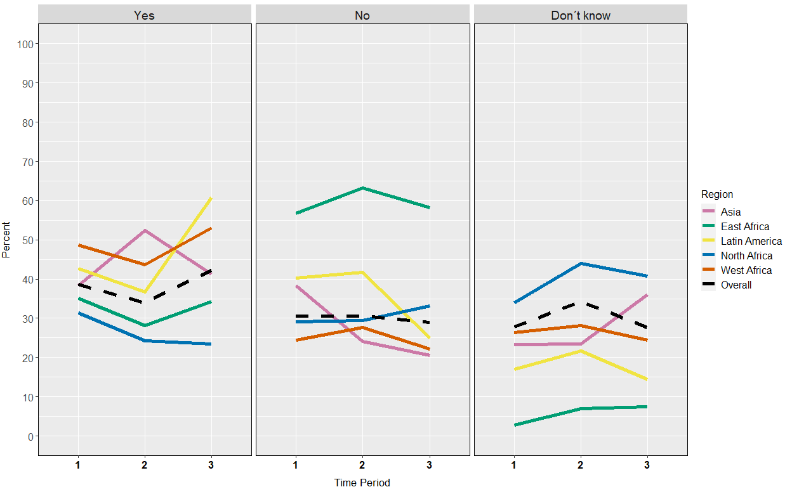
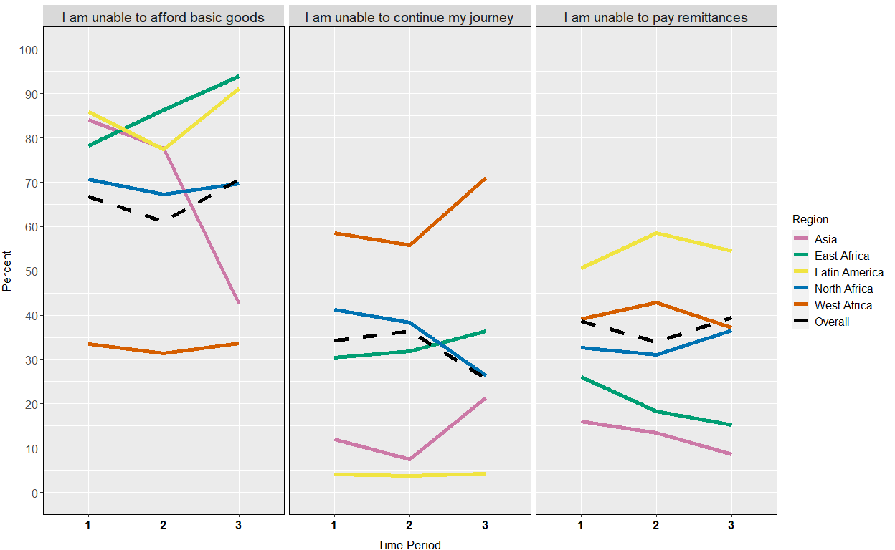

Impact of COVID-19 on refugees and migrants, Update 5
================
Mixed Migration Centre, 30 June 2020

 

**This is the fifth update on the situation for refugees and migrants on
mixed migration routes around the world in light of the COVID-19
pandemic, based on data collected by the [Mixed Migration
Centre](http://www.mixedmigration.org/). As MMC moves to a new phase in
its data collection, this update looks at changes over time on the
themes covered in the Global Updates since April: COVID-19 awareness,
knowledge and risk perception, access to healthcare, assistance needs
and the impact on refugees’ and migrants’ lives and migration journeys.
It also includes data on Afghan returnees. New Global Updates will be
available soon, and for more detailed, thematic and response-oriented
COVID-19 snapshots from each of the MMC regional offices, see
[here](http://www.mixedmigration.org/resource-type/covid-19/).**

## Key Messages

• Knowledge of COVID-19 remains stable, and concern is high among
refugees and migrants, although there has been a decrease in reports of
fear of transmission. At the same time, the proportion of respondents
not taking measures to protect themselves from the disease is falling

• The proportion of respondents reporting barriers to healthcare is
falling, and especially in Latin America, a greater share are reporting
that they can access healthcare

• There are suggestions that some aspects of day-to-day life may be
normalizing (although the limitations on the data must be taken into
consideration). Fewer are reporting a reduced availability of basic
goods, fewer are reporting loss of income (especially in North Africa
and West Africa), and fewer are saying that loss of income is impacting
on their ability to afford basic goods. Stress and anxiety, however,
have been increasingly reported over time

• Inability to continue the journey is increasingly reported, except in
North Africa, where the proportion has dropped considerably over time.
However, the proportion reporting that the crisis has not impacted on
their journey has increased, as has the proportion reporting that the
crisis has not impacted on their plans. Fewer people are reporting that
they have decided to stay where they are for the time being

• The proportion reporting needs has stayed consistently very high. The
need for cash is most frequently reported, and has grown. While
assistance received remains much lower than what is needed, the
proportion receiving cash has grown. The perceived need for information
has fallen.

## Respondents

4,124 respondents were interviewed between 6 April and 8 June 2020, with
302 in Asia, 161 in East Africa, 646 in Latin America, 1,886 in North
Africa, and 1,129 in West Africa:

|    Region     |   Country    | Number of respondents | Percent women | Mean age |
| :-----------: | :----------: | :-------------------: | :-----------: | :------: |
|     Asia      |    India     |          112          |      38       |    33    |
|               |  Indonesia   |          117          |      39       |    29    |
|               |   Malaysia   |          73           |      41       |    27    |
|  East Africa  |    Kenya     |          59           |      46       |    33    |
|               |  Somaliland  |          102          |      35       |    31    |
| Latin America |   Colombia   |          496          |      74       |    34    |
|               |     Peru     |          150          |      60       |    33    |
| North Africa  |    Libya     |          935          |      30       |    30    |
|               |   Tunisia    |          951          |      36       |    28    |
|  West Africa  | Burkina Faso |          327          |      43       |    28    |
|               |     Mali     |          422          |      18       |    27    |
|               |    Niger     |          380          |      29       |    31    |
|    Overall    |              |         4,124         |      38       |    30    |

In Latin America, all respondents were Venezuelans, while in Asia, 76%
of respondents were Afghans (15% were from Myanmar, and 9% from
Bangladesh). Data collection in Malaysia only began in period 2.
Respondents in East Africa, North Africa and West Africa were from a
wide range of African countries.

For the purpose of this update looking at trends over time (see
methodology), the respondents were split in the following three time
periods:

| Period | From  |  To   | Asia | East Africa | North Africa | West Africa | Latin America |
| :----: | :---: | :---: | :--: | :---------: | :----------: | :---------: | :-----------: |
|   1    | 06/04 | 05/05 |  60  |     37      |     988      |     586     |      377      |
|   2    | 06/05 | 20/05 | 145  |     57      |     596      |     326     |      60       |
|   3    | 21/05 | 08/06 |  97  |     67      |     302      |     217     |      209      |

## Methodology

A summary of the methodology can be found
[here](http://www.mixedmigration.org/4mi/4mi_faq/). For this update, the
whole dataset was split into three time periods. It is important to note
that the respondents were not the same over the three time periods
(i.e. we did not interview the same respondents several times as in a
panel or longitudinal study). Respondents were however recruited in the
same locations, from the same target population and using the same
method. All figures are rounded to the nearest whole number. Figures for
countries where the number of interviews is less than or around 100
should be interpreted with caution, especially in East Africa, and
period 1 in Asia, and period 2 in Latin America. Unless specified, the
number of observations for all analyses and visualisations corresponds
to those presented in the above table. Note that for most items of the
questionnaire, respondents can select several answer options. 88
interviews were discarded from analyses due to questionnaire
incompleteness or data quality issues.

## Awareness, knowledge and risk perception

Overall, the number of respondents who agree or strongly agree that they
are worried about catching coronavirus has remained remarkably stable
over time, at around 89%. However, we can see a decreasing trend in
especially West Africa (from 90% at Time 2 to 83% at Time 3).

The number of respondents who agree or strongly agree that they are
worried about transmitting coronavirus has tended to decrease over time
(from 70% at Time 1 to 67% at Time 3), see Figure 1. This is the case in
all regions, except East Africa and Asia, where the number of interviews
is low. The sharpest decrease was in North Africa, from 68% to 55%.

***Figure 1: Percentage of respondents who agree or strongly agree that
they are worried about transmitting coronavirus, over time***

   

As observed in previous updates, the number of respondents who
reportedly know how to protect themselves is high, and has remained
stable over time, with a slight increase from the second (83%) to third
time period (87%). Given the efforts to provide information about
prevention since the pandemic was declared, an increase in knowledge
could have been expected, even though respondents already showed a high
level of knowledge when data collection started.

Likewise, the overall proportion of respondents reporting not doing
anything to protect themselves against coronavirus has remained low over
time, but with interesting differences between regions. In West Africa,
there seems to be a clear decreasing trend (from 20% at Time 1 to 13% at
Time 3), whereas in East Africa, the figure has increased over the three
time periods (from 8% to 27%).

In all regions but one, there has been a fall in the percentage of
respondents staying at home to protect themselves from catching
coronavirus (East Africa: from 38% to 30%; Latin America: from 88% to
74%; North Africa: from 54% to 36%; West Africa: from 8% to 4%). While
lockdown measures have somewhat eased in some locations, the fall may
also be attributable to people needing to leave their home more, e.g. to
work. In Asia, by contrast, the figure increased from 80% in the first
period to 87% in the last period. This is likely linked to the fact that
later time periods include data from Malaysia.

## Access to healthcare and prevention

When looking at the data over time (Figure 2), we see that the
proportion of people who believe they could not access healthcare,
overall, has slightly decreased (from 31% at Time 1 to 29% at Time 3),
except in Asia (from 38% to 21%) and Latin America (from 40% to 25%).
Note that the inclusion of data from Malaysia from period 2 only is
likely to have influenced this more dramatic drop, as respondents from
Malaysia have reported better access to healthcare.

***Figure 2: Percentage of respondents who believe they could access
healthcare, over time***

   

Reflecting this change, Latin America saw a large increase in
respondents believing they would be able to access healthcare from 37%
(n=22) during the second period to 61% (n=127) in the last period, which
could at least partially be explained by information campaigns. The
proportion of respondents who simply don’t know whether they would be
able to access healthcare has also tended to remain roughly stable over
time, with a peak at 34% during the second time period.

Since the beginning of data collection, the main barriers to accessing
healthcare cited by respondents are a lack of money, followed by not
knowing where to go, and discrimination against foreigners. This does
not change when the data are analysed over time, as can be seen in
Figure 3. However, all barriers are less frequently reported over time,
which aligns with the slight increase in respondents who identified no
barrier (from 8% to 11%).

***Figure 3: What are the barriers to accessing healthcare?***

   

## Impact on refugees’ and migrants’ lives

The main impacts of COVID-19 on refugees’ and migrants’ lives have been
reduced access to work, more stress, and reduced availability of basic
goods, and this has remained very stable over time.

Racism and xenophobia have tended to slightly decrease overall (from 20%
in the first period to 17% in the last period), which seems to be mainly
due to North Africa (from 26% to 21%), but was stable in all other
regions, including in Latin America, where a 10% decrease during the
second period is, arguably, only due to the low number of interviews at
this time (n=60).

More clearly, the impact on availability of basic goods has decreased
from the first period to the last period, although it remains high,
particularly in Asia (Asia: from 68% to 60%; East Africa: from 68% to
43%; North Africa: from 58% to 56%; West Africa: from 28% to 21%). In
contrast, respondents in Latin America have more frequently reported an
impact on the availability of basic goods. The overall trends (see
Figure 4) fit with the patterns of assistance needed vs assistance
received, below.

***Figure 4: Percentage of respondents citing reduced availability of
basic goods as an impact, over time***

   

Another potentially encouraging trend is that the proportion of
respondents who lost income due to coronavirus restrictions has slightly
decreased over time (from 60% in the first period to 57% in the last
period). This includes the two regions with more interviews, North
Africa (from 57% to 49%) and West Africa (from 47% to 40%). Latin
America, where so far respondents more often reported a loss of income
compared to other regions, has remained stable (from 90% to 91%). In
Asia, loss of income has been more frequently reported, again perhaps
because of the addition of data from Malaysia (from 42% to 49%), see
Figure 5.

***Figure 5: Percentage of respondents who lost income due to
coronavirus restrictions, over time***

   

The share of respondents who report losing income in each region has
remained stable overall. In contrast, the inability to afford basic
goods has been reported far less frequently in Asia (from 84% in the
first period to 43% in the last period), whereas it tended to be stable
or slightly increase in other regions, see left panel in Figure 6.
Additionally, the inability to continue the journey has tended to
increase in most regions, except in North Africa (from 41% in the first
period to 26% in the last period, see middle panel in Figure 6).
Finally, the inability to pay remittances has remained stable or has
tended to increase (in North Africa), but has decreased in the regions
with fewer interviews (Asia and East Africa), see right panel in Figure
6.

***Figure 6: Impacts of loss of income by region, over time***

  

## Assistance needs

The need for extra assistance has remained very high and has slightly
increased over time (from 86% to 88%), except in North Africa, where on
the contrary it has tended to slightly decrease (from 85% to 80%).

  
***Figure 7: Types of assistance needed, over time***

   

As shown in Figure 7, cash is the most reported need. The need has grown
between the first period and the last period in all regions, except in
Asia, where it decreased (from 71% to 63%), see Figure 8.

Sanitary/PPE items such as sanitizer, masks, and gloves, which were
overall the third most-cited need, is also the only need that has
clearly tended to decrease over time (from 42% in the first period to
30% in the last period), see Figure 7, which is in line with the
slightly decreasing proportion of respondents concerned about
transmitting the virus.

***Figure 8: Types of assistance needed, over time***

   

As highlighted in previous updates, although more than 85% of all
participants consistently state that they need extra assistance, less
than 25% actually received such extra assistance since beginning of data
collection. However, an encouraging trend is emerging when analysing the
data over time. Although assistance received was stable in the first two
periods (20% and 21%, respectively), it has clearly increased in the
last period, with 33% (n=294) of respondents reporting to have benefited
from it. Furthermore, assistance received has increased in all regions
(Figure 9), except in East Africa (from 19% to 3%), although the number
of interviews is low in this region.

***Figure 9: Types of assistance needed, over time***

   

Over time, the most frequently cited types of assistance received have
remained the same: basic needs, sanitary items, and cash. The only
exception is information about the virus, which has decreased over time
(from 20% in the first period to 10% in the last period). This fits well
with the observed trend of fewer respondents citing a need for
information, see Figure 7 above. Given that cash assistance is the most
cited need, it is encouraging to see a slight increase in the proportion
of respondents who received cash assistance (from 23% to 25%). When
looking at trends in each region, extra assistance received in terms of
basic needs has decreased in Asia (from 62% in the first period to 40%
in the last period, although the number of interviews is low). In
contrast, the proportion of respondents saying they received sanitary
items have increased in West Africa (from 42% in the first period to 61%
in the last period), although fewer respondents in West Africa actually
report this as a need (from 49% in the first period to 43% in the last
period).

## Impact on migration journeys

As discussed in previous updates, the impact on migration journeys
differs between regions, with increased difficulty moving around inside
countries or crossing borders being most frequently cited. Over time,
however, we can see an increasing trend of respondents reporting that
the crisis had no impact on their journey, see Figure 10, with a
proportion of 34% of all participants reporting this in the last period,
compared to 20% in the first period. That said, note that this trend is
only minor in West Africa (from 7% to 8%).

  

***Figure 10: Percentage of respondents who stated that coronavirus had
no impact on their journey, over time***

   

This trend is reflected in respondents increasingly reporting that they
have not changed their plans as a result of the coronavirus outbreak
(from 50% to 57%), while the proportion of respondents who stopped for a
while is decreasing (from 24% to 18%), see Figure 11.  

***Figure 11: What impact has the loss of income had?***

### Acknowledgement

The owner and source of the data used for this study is the [Mixed
Migration Centre](http://www.mixedmigration.org/), and this study has
been published first
[here](http://www.mixedmigration.org/resource-type/covid-19/) on 30 June
2020. Data analyst: Jean-Luc Jucker, PhD
